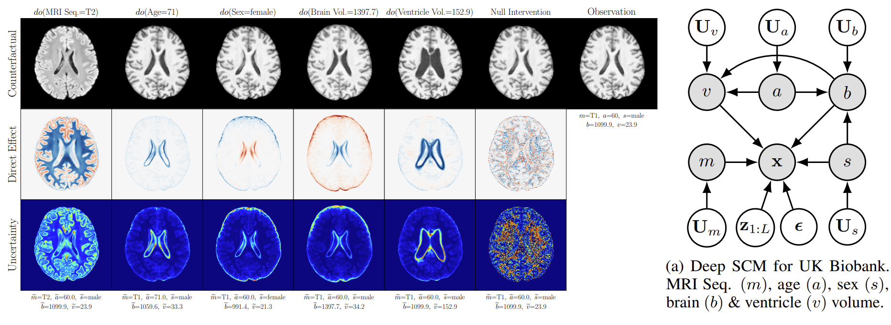
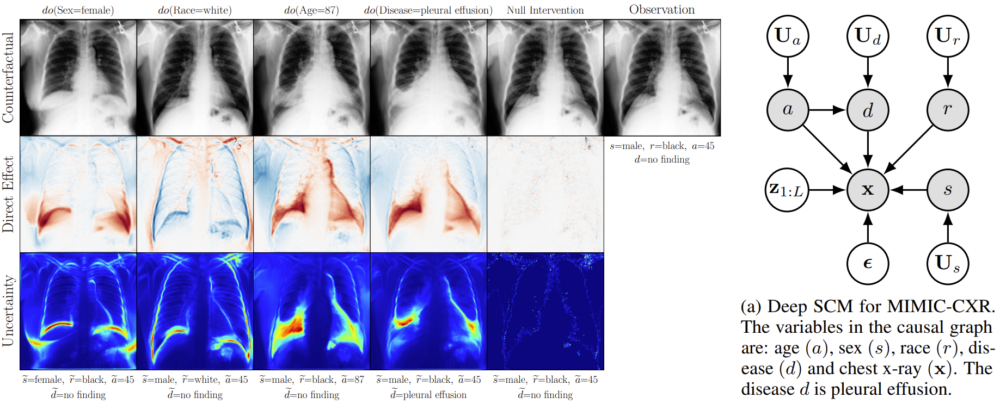
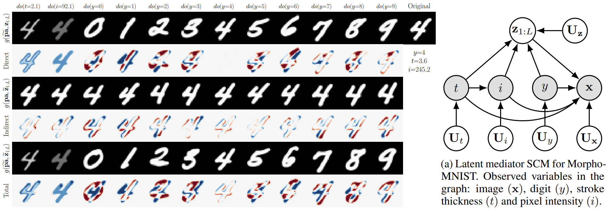

## Causal Generative Modelling: Image Counterfactuals
[:hugs:Huggingface demo here!:hugs:](https://huggingface.co/spaces/mira-causality/counterfactuals)

Code for the **ICML 2023** paper:

>[**High Fidelity Image Counterfactuals with Probabilistic Causal Models**](https://arxiv.org/abs/2306.15764)\
>Fabio De Sousa Ribeiro<sup>1</sup>, Tian Xia<sup>1</sup>, Miguel Monteiro<sup>1</sup>, Nick Pawlowski<sup>2</sup>, Ben Glocker<sup>1</sup>\
><sup>1</sup>Imperial College London, <sup>2</sup>Microsoft Research Cambridge, UK

BibTeX (arXiv for now):
```
@misc{ribeiro2023high,
      title={High Fidelity Image Counterfactuals with Probabilistic Causal Models}, 
      author={Fabio De Sousa Ribeiro and Tian Xia and Miguel Monteiro and Nick Pawlowski and Ben Glocker},
      year={2023},
      eprint={2306.15764},
      archivePrefix={arXiv},
      primaryClass={cs.LG}
}
```
### Example Results:




### Project Structure:

```
📦src                                  # main source code directory
 ┣ 📂pgm                               # graphical models for all SCM mechanisms except the image's
 ┃ ┣ 📜dscm.py                         # deep structural causal model Pytorch module
 ┃ ┣ 📜flow_pgm.py                     # Flow mechanisms in Pyro
 ┃ ┣ 📜layers.py                       # utility modules/layers
 ┃ ┣ 📜resnet.py                       # resnet model definition
 ┃ ┣ 📜run.sh                          # example launch script for counterfactual training (slurm)
 ┃ ┣ 📜train_cf.py                     # counterfactual training code
 ┃ ┣ 📜train_pgm.py                    # SCM mechanisms training code (Pyro)
 ┃ ┗ 📜utils_pgm.py                    # graphical model utilities
 ┣ 📜datasets.py                       # dataset definitions
 ┣ 📜dmol.py                           # discretized mixture of logistics likelihood
 ┣ 📜hps.py                            # hyperparameters for all datasets
 ┣ 📜main.py                           # main file
 ┣ 📜run_local.sh                      # example launch script for HVAE causal mechanism training
 ┣ 📜run_slurm.sh                      # same as above but for slurm jobs
 ┣ 📜simple_vae.py                     # single stochastic layer VAE
 ┣ 📜trainer.py                        # training code for image x's causal mechanism
 ┣ 📜train_setup.py                    # training helpers
 ┣ 📜utils.py                          # utilities for training/plotting
 ┗ 📜vae.py                            # HVAE definition; exogenous prior and latent mediator models 
 ```

### Overview
Our deep structural causal models (SCMs) were designed to be modular: in all instances, the causal mechanism for the structured variable (i.e. image $\mathbf{x}$) is trained separately from the other mechanisms in the associated causal graph.
This enables direct and fair comparisons of different causal mechanisms for $\mathbf{x}$ by holding the remaining mechanisms fixed when making comparisons. 

We use the universal probabilistic programming language (PPL) [Pyro](https://pyro.ai/) for the following:

1. Modelling and training all SCM mechanisms except for the image $\mathbf{x}$'s, see code in `src/pgm`; 
2. The counterfactual inference engine, see `src/pgm/flow_pgm.py`; 
3. Proposed constrained counterfactual training technique, see `src/pgm/train_cf.py`.

Pyro enables flexible and expressive deep probabilistic modeling, for more details refer to the [official site](https://pyro.ai/). 

Our HVAE-based causal mechanisms (`src/vae.py`) are trained outside of Pyro using Pytorch, and all trained mechanisms are subsequently merged into a single Pytorch module to create a DSCM. See `src/pgm/dscm.py` for an example.

### Requirements
To run the code you will need to install the requirements listed in the `requirements.txt` file. E.g. from inside your env of choice run:
```
pip install -r requirements.txt
```

### Data
For ease of use, we provide the [Morpho-MNIST](https://github.com/dccastro/Morpho-MNIST) dataset we used in `datasets/morphomnist`. For more details on the associated SCM and data-generating process see the source code [here](https://github.com/biomedia-mira/deepscm) and the original DSCM paper [here](https://arxiv.org/abs/2006.06485). 

The Colour-MNIST dataset we used was generated according to [this paper](https://arxiv.org/abs/2303.01274).

Unfortunately, we are unable to share the UK Biobank brain data or the MIMIC-CXR chest x-ray data. 

If you're interested in gaining access, we recommend you check out the specific documents provided. These resources contain all the necessary details regarding the application process, as well as the eligibility criteria. Application and eligibility criteria for gaining access are detailed [here](https://www.ukbiobank.ac.uk/enable-your-research/apply-for-access) and [here](https://physionet.org/content/mimic-cxr/2.0.0/) respectively.

### Run
To launch (local) training of the HVAE mechanism simply run the following script from inside the `src` directory:
```
bash run_local.sh your_experiment_name
```
To run in the background you can append `nohup` to the command: `bash run_local.sh your_experiment_name nohup`. Adjust the `run_command` inside the script as needed. Hyperparameters can be found in `src/hps.py`.
If using [Slurm Workload Manager](https://slurm.schedmd.com/documentation.html), adjust `src/run_slurm.sh` as needed and launch as `bash run_slurm.sh`.

Example (loose) steps to add your own dataset and associated SCM:

1. Add dataset class definition to `src/datasets` and setup the dataloader in `src/train_setup.py`
2. Add associated causal graph and mechanism definitions in `src/pgm/flow_pgm.py`
3. Adjust HVAE hyperparameters needed for your dataset (input resolution, architecture, etc) in `src/hps.py`
4. Train the HVAE mechanism as above, and train all other mechanisms (separately) using `src/pgm/train_pgm.py`

If you'd like to make the HVAE more lightweight you can try reducing the number of blocks at each resolution and reducing the block width (hyperparameters `enc_arch`, `dec_arch`, and `width` found in `src/hps.py`). The block `version == "light"` in `src/vae.py` also uses half as much VRAM.

To resume training from a checkpoint simply adjust the argument: `--resume=/path/to/your/checkpoint.pt`.

(readme is a work in progress)
